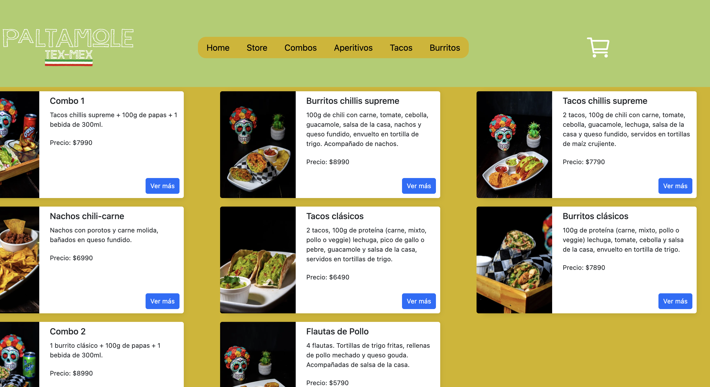

# Paltamole

## Resumen

Paltamole es una tienda en línea creada con React, que permite a los usuarios navegar, agregar productos a su carrito de compras y proceder al pedido. El proyecto integra Firebase para el almacenamiento de productos y el manejo de órdenes. Además, utiliza varias librerías modernas para mejorar la experiencia del usuario y facilitar el desarrollo.

¡Bienvenidos a Paltamole! 

  <!-- Asegúrate de poner tu propia URL de imagen -->

---

## Instalación

Para correr este proyecto localmente en tu máquina, sigue estos pasos:

### Requisitos

- Node.js (preferentemente versión LTS)
- npm o yarn (gestores de paquetes de Node.js)

### Paso 1: Clonar el repositorio

```bash
git clone https://github.com/Pourbaix02/lopez-paltamole-coder
```

### Paso 2: Instalar las dependencias

Dirígete a la carpeta del proyecto e instala las dependencias utilizando npm o yarn:

Con npm:

```bash
cd paltamole-coder
npm install
```


### Paso 3: Ejecutar la aplicación

Con npm:

```bash
npm run dev
```


Este comando abrirá la aplicación en `http://localhost:5173` en tu navegador.

---

## Version Host

Si deseas ver el proyecto en línea, puedes ingresar al siguiente enlace:

[Paltamole en Vivo](https://lopez-paltamole-coder.vercel.app/)

---

## Librerías utilizadas

Este proyecto hace uso de varias librerías para facilitar el desarrollo y mejorar la experiencia del usuario. Algunas de las más destacadas son:

- **[Bootstrap](https://getbootstrap.com/)**: Utilizada para el diseño y la maquetación de la interfaz de usuario.
- **[React](https://reactjs.org/)**: Librería principal para la construcción de la interfaz de usuario, utilizando componentes reactivos.
- **[React Bootstrap](https://react-bootstrap.github.io/)**: Versiones de Bootstrap para React, para integrar fácilmente los componentes de Bootstrap en una aplicación React.
- **[Ant Design](https://ant.design/)**: Un sistema de diseño UI con una gran variedad de componentes listos para usar, como botones, mensajes, modales, etc.
- **[Firebase](https://firebase.google.com/)**: Usado para el manejo de bases de datos en tiempo real, autenticación de usuarios y almacenamiento en la nube.
- **[React Router Dom](https://reactrouter.com/)**: Para manejar la navegación entre las distintas páginas de la tienda.
- **[React Spinners](https://www.npmjs.com/package/react-spinners)**: Librería para mostrar animaciones de carga mientras se espera la respuesta de la API o una acción.

---

## Funcionalidades

### 1. Visualización de Productos
Los usuarios pueden navegar por diferentes categorías de productos, visualizar detalles, y agregar productos al carrito.

### 2. Carrito de Compras
El carrito muestra los productos agregados, sus cantidades y el precio total. Los usuarios pueden eliminar productos o actualizar las cantidades antes de proceder al pago.

### 3. Proceso de Checkout
Una vez que el usuario está listo para comprar, puede completar un formulario con su información personal y proceder a realizar la compra. Al finalizar, se genera un ID único de la orden y se muestra un mensaje de éxito.

---

## Estructura del Proyecto

La estructura del proyecto sigue una convención común en aplicaciones React. Aquí hay un vistazo de la estructura de carpetas:

```
/paltamole-coder
├── package-lock.json
├── package.json
├── public
│   ├── avocado.svg
│   └── images
│       ├── aperitivos
│       │   ├── flautas-de-pollo.jpg
│       │   ├── nachos-con-guacamole.jpg
│       │   ├── nachos-chili-carne.jpg
│       │   └── nachos-supreme.jpg
│       ├── burritos
│       │   ├── burritos-clasicos.jpg
│       │   ├── burritos-crispy.jpg
│       │   ├── burritos-crunch.jpg
│       │   ├── burritos-chillis-supreme.jpg
│       │   └── burritos-guacamole.jpg
│       ├── combos
│       │   ├── combo-cheese.jpg
│       │   ├── combo1.jpg
│       │   ├── combo2.jpg
│       │   ├── combo3.jpg
│       │   ├── combo4.jpg
│       │   ├── mega-combo.jpg
│       │   └── super-combo.webp
│       ├── quesadillas
│       │   ├── quesadilla-supreme.jpg
│       │   └── quesadillas-guacamole.jpg
│       └── tacos
│           ├── tacos-clasicos.jpg
│           ├── tacos-crispy.jpg
│           ├── tacos-crunch.jpg
│           ├── tacos-chillis-supreme.jpg
│           └── tacos-guacamole.jpg
├── src
│   ├── App.css
│   ├── App.jsx
│   ├── assets
│   │   ├── landing1.jpg
│   │   └── logo.svg
│   ├── components
│   │   ├── BrandLogo.jsx
│   │   ├── CartContainer.jsx
│   │   ├── CartItem.jsx
│   │   ├── CartList.jsx
│   │   ├── CartWidget.jsx
│   │   ├── Checkout.jsx
│   │   ├── EmptyCart.jsx
│   │   ├── Header.jsx
│   │   ├── Item.jsx
│   │   ├── ItemCount.jsx
│   │   ├── ItemDetail.jsx
│   │   ├── ItemDetailContainer.jsx
│   │   ├── ItemList.jsx
│   │   ├── ItemListContainer.jsx
│   │   ├── Loader.jsx
│   │   ├── Navbar.jsx
│   │   ├── PageLanding.jsx
│   │   └── StoreView.jsx
│   ├── context
│   │   └── CartContext.jsx
│   ├── index.css
│   ├── main.jsx
│   ├── service
│   │   └── firebase.jsx
│   ├── styles
│   │   ├── Navbar.css
│   │   ├── PageComplement.css
│   │   └── item.css
│   └── utils
│       └── data.jsx
└── vite.config.js
```

---

## Desarrollado por

Este proyecto fue desarrollado por [Pourbaix](https://github.com/Pourbaix02), un desarrollador apasionado por crear aplicaciones web interactivas y dinámicas.

---

## Contribuciones

Las contribuciones son bienvenidas. Si deseas mejorar o añadir características, abre un **pull request** o abre un **issue** en el repositorio.

---

